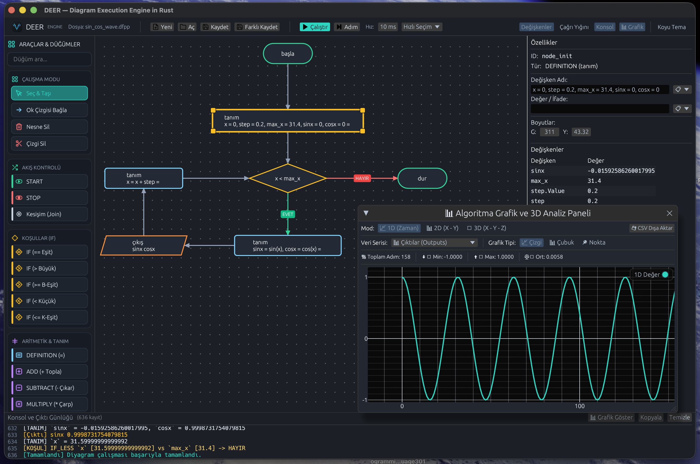

<p align="center">
  
</p>

<h1 align="center">DEER — Diagram Execution Engine in Rust</h1>

<p align="center">
  
  
  
  
</p>



**DEER (Diagram Execution Engine in Rust)**, akış şeması (Flowchart) tabanlı görsel programlama dili, yorumlayıcı motoru ve entegre geliştirme ortamıdır (IDE). Kullanıcıların görsel olarak algoritma tasarımı yapmalarına, adım adım veya sürekli modda çalıştırmalarına, değişken durumlarını anlık izlemelerine ve sayısal çalışma sonuçlarını 1D, 2D ve 3D grafikler ile analiz etmelerine olanak tanır.

---

## Mimarisi ve Temel Özellikleri

### 1. Görsel Akış Şeması Tuvali (Visual Canvas Engine)
- **Geometrik Işın Kırpma (Ray Clipping)**: Karar (Baklava), Kesişim (Çember) ve Giriş/Çıktı (Paralelkenar) düğümlerine temas eden bağlantı okları, şekillerin trigonometrik kenar sınırlarına tam açıyla teğet hizalanır.
- **Merkez Odaklı Izgara Hizalaması (Center-Based Grid Snapping)**: Düğümler sürüklendiğinde veya tuvale eklendiğinde merkez koordinatları (`Center X, Y`) 20px ızgara adımlarına tam hizalanır. Farklı boyutlardaki şekiller arasındaki dikey ve yatay bağlantı çizgileri tam dik açılı ve düzgün kalır.
- **4 Köşeli Fare İle Boyutlandırma (Interactive Resizing)**: Seçili düğümler 4 köşesindeki tutamaçlar aracılığıyla fare ile canlı olarak yeniden boyutlandırılabilir.
- **Odak Noktalı Yakınlaştırma (Focal-Point Zoom & HUD)**: Fare imlecinin bulunduğu konumu merkez alarak %25 ile %350 aralığında yakınlaştırma/uzaklaştırma ve yüzen tuval kontrol paneli sunar.

### 2. Yorumlayıcı ve Matematiksel İfade Motoru (Execution Engine)
- **Metin ve Tırnaksız İfade Ayrıştırma**: Çift tırnak zorunluluğu olmaksızın sabit metin değerleri ve değişkenler doğrudan tanımlanabilir ve karşılaştırılabilir.
- **Gelişmiş Matematiksel Fonksiyon Desteği**: İfadelerde `cos(x)`, `sin(y)`, `tan(x)`, `asin`, `acos`, `atan`, `abs`, `sqrt`, `exp`, `log`, `ln`, `factorial` fonksiyonları doğrudan hesaplanabilir.
- **Çoklu Tanım Satırları**: Tek bir tanım düğümü içerisinde virgüle göre ayrılmış birden fazla atama ifadesi yürütülebilir (Örnek: `x = 0.5, y = 1.0, cx = cos(x), sy = sin(y)`).
- **Alt-Diyagram ve Fonksiyon Çağrıları**: Fonksiyon düğümleri aracılığıyla bağımsız alt diyagramlar çağrılabilir, parametre aktarımı yapılabilir ve çağrı yığını (Call Stack) üzerinden geri dönülebilir.

### 3. 1D, 2D ve 3D Grafik Analiz Motoru (Spatial Charting)
- **1D Zaman Serisi Grafiği**: Çalıştırma adımlarına bağlı olarak sayısal çıktı ve değişken geçmişlerini Çizgi (Line), Çubuk (Bar) ve Nokta (Scatter) grafiklerinde görselleştirir. Minimum, maksimum ve ortalama değer istatistiklerini sunar.
- **2D Parametrik Grafik (X vs Y)**: İki değişken arasındaki fonksiyonel ve parametrik ilişkileri (Örnek: Birim çember $X = \cos(t), Y = \sin(t)$) 2D düzlemde görselleştirir.
- **3D Mekânsal Yörünge Grafiği (X vs Y vs Z)**: 3 boyutlu yörünge ve uzay verilerini ($X, Y, Z$) 3D perspektif görünümde çizer. Fare sürüklemesi ile 360° dönebilen 3D Orbit kamera ve açı kontrolü sunar.
- **CSV Dışa Aktarımı**: 1D, 2D ve 3D veri setlerini standart `.csv` formatında dışa aktarır.

### 4. Özellik Müfettişi ve Değişken Seçici (Inspector & Variable Picker)
- Düğüm başlığı, ifadeler, hedef değişken ve renklerin detaylı yönetimi.
- Giriş alanlarının yanında yer alan değişken seçim menüsü ile tuvaldeki değişkenlerin dinamik listelenmesi ve seçimi.

### 5. Dosya Biçimleri
- **`.dfpp` (Modern JSON Formatı)**: Diyagramların şeffaf, sürüm kontrolüne uygun JSON biçiminde saklanması.
- **`.fpp` (Legacy Format)**: Geriye dönük klasik akış şeması formatı desteği.

---

## Kurulum ve Çalıştırma

### Gereksinimler
- Rust Derleyicisi (v1.70+)

### Çalıştırma Komutları
```bash
# Projeyi klonlayın
git clone https://github.com/user/FlowChartVisualProgrammingLanguage301.git
cd FlowChartVisualProgrammingLanguage301

# Uygulamayı derleyin ve çalıştırın
cargo run --release
```

### Birim Testleri Çalıştırma
```bash
cargo test
```

---

## Örnek Diyagramlar (`examples/`)

Projede yer alan örnek diyagramlar:

| Dosya Adı | Açıklama |
| :--- | :--- |
| `examples/sin_cos_wave.dfpp` | $\sin(x)$ ve $\cos(x)$ trigonometrik dalga ve birim çember analizi |
| `examples/trig_calc.dfpp` | Trigonometrik fonksiyon hesaplamaları ve değişken takibi |
| `examples/spiral3d.dfpp` | 3D dairesel yörünge algoritması ve 3D grafik görselleştirmesi |
| `examples/fibonacci.dfpp` | Fibonacci dizisi algoritması |
| `examples/factorial.dfpp` | Faktöriyel hesabı ve döngü yapısı |
| `examples/B4.fpp` | Metin atamaları ve çıktı kontrolü |

---

## Kullanım İpuçları

- **Tuval Kaydırma (Pan)**: Fare sol tuşuna boş tuvalde basılı tutarak veya orta tuşla sürükleyin.
- **Yakınlaştırma (Zoom)**: Fare tekerleğini kaydırın veya dokunmatik yüzeyde iki parmakla kıstırın.
- **Grafik Analiz**: Üst araç çubuğundaki **Grafik** düğmesine veya konsol paneli üzerindeki **Grafik Göster** düğmesine basarak grafik penceresini açın.

---

## Lisans

Bu proje MIT Lisansı altında sunulmaktadır.
